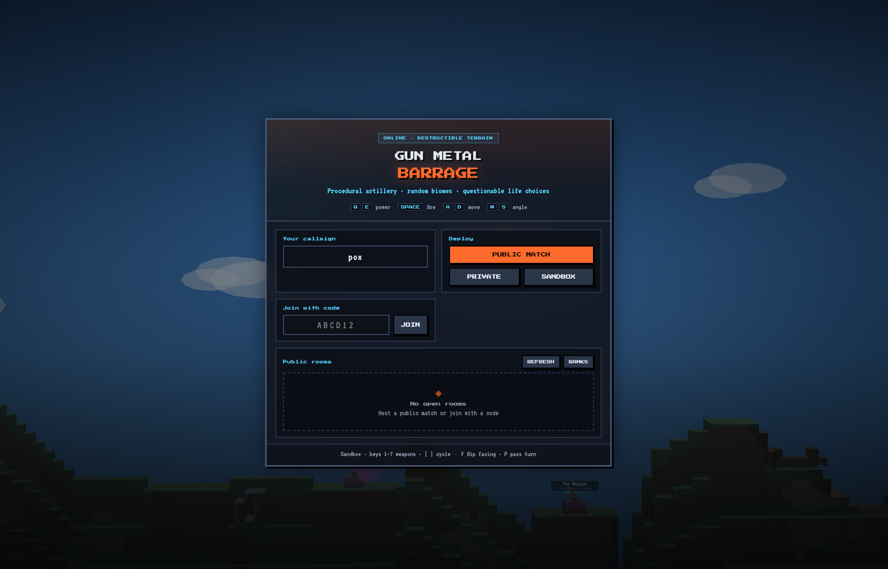

# Gun Metal Barrage

Turn-based **2.5D voxel artillery** (Gunbound / Worms inspired) with destructible terrain, procedural maps & loadouts, online lobbies, and bot pilots.



## Play

**Live:** [https://gunmetal-barrageserver-production.up.railway.app/](https://gunmetal-barrageserver-production.up.railway.app/)

The production build serves the **client and Colyseus server on the same origin** (`https` / `wss`). Menu and lobby run a live ambient battle in the background while you queue up.

## Features

- **2.5D side arena** — side-view camera, tanks drive on X, full-depth terrain digs so columns stay consistent
- **Destructible voxels** — large craters; **Bunker Buster** digs deep shafts + undercuts to collapse cover
- **Procedural maps** — biomes (meadow, desert, canyon, volcanic, arctic, ruins), gulfs, ridges, mesas, bridges
- **Scattered spawns** — shuffled pads across the map (not fixed left/right lanes)
- **Turn-based combat** — move → set power → fire; wind; turn timer; full fuel each turn
- **Power meter fire** — Q/E (or HUD ±) sets power; **Space** / **FIRE** shoots once (no hold-to-charge)
- **Alt weapons** — **R** fires secondary (often a **one-shot Mini Nuke**); primaries include **Heat Seeker** homing rockets
- **Short aim guide** — only the early arc is shown (no free impact reticle)
- **Budget loadouts** — procedural tanks/weapons under a point cap; weapon catalog testable in Sandbox
- **Lobbies** — public rooms, private join codes, unique bot pilots, ready meter
- **Character select** — each pilot picks from **3 tank kits** (chassis + primary + alt) before ready
- **Leaderboard** — post-match rankings in SQLite (mount a volume + `DATA_DIR` to keep them)
- **Sudden death** — after ~16 turns, one random hazard: rising waters, buried exploding mountain, hostile UFO, or mega hurricane with debris
- **Reconnect** — disconnect holds your seat ~75s; resume from the menu with the same callsign
- **Bot difficulty** — Easy / Normal / Hard (menu settings); bots avoid void edges
- **Mute** — menu toggle or press **M**
- **Sandbox** — keys 1–8 to try every weapon behavior (single, lob, cluster, drill, bounce, triple, nuke)

## Stack

| Layer | Tech |
|-------|------|
| Client | Vite, TypeScript, Three.js |
| Server | Node.js, Colyseus, Express |
| Shared | Types, proc-gen, ballistics, game rules |
| Physics | Analytic ballistics + voxel collision |
| Deploy | Railway (Nixpacks) — monorepo single service |

## Monorepo

```
packages/
  shared/   # types, RNG, map/loadout gen, ballistics, protocol
  server/   # Colyseus rooms, simulation, AI, leaderboard DB
  client/   # Three.js renderer, HUD, lobby UI, networking
```

## Quick start

```bash
npm install
npm run build:shared
npm run dev:server   # terminal 1 — http://localhost:2567
npm run dev:client   # terminal 2 — http://localhost:5173
```

For a single-process production build (same as Railway):

```bash
npm install
npm run build
npm start
# open http://localhost:2567
```

## Controls

| Input | Action |
|-------|--------|
| A / D | Move |
| W / S | Aim angle |
| Q / E (or , / .) | Lower / raise power |
| Space or FIRE | Fire primary at current power |
| R or FIRE ALT | Fire secondary / special (e.g. Mini Nuke ×1) |
| F | Flip facing |
| P | Pass turn |
| 1–8 | Sandbox weapon select |
| [ ] | Sandbox cycle weapons |
| Esc | Sandbox → menu |

## Scripts

| Command | Description |
|---------|-------------|
| `npm run dev:client` | Vite dev server |
| `npm run dev:server` | Colyseus with hot reload |
| `npm run build:shared` | Compile shared package |
| `npm run build` | Build shared + server + client |
| `npm start` | Production server (static client + Colyseus) |
| `npm run typecheck` | Typecheck all workspaces |

## Deploy (Railway)

**Production:** [https://gunmetal-barrageserver-production.up.railway.app/](https://gunmetal-barrageserver-production.up.railway.app/)

One Railway service runs **Colyseus + Express + the built Vite client** on the same host.

### Steps

1. Push this repo to GitHub.
2. [Railway](https://railway.app) → **New Project** → **Deploy from GitHub**.
3. Use **one service** at the **monorepo root** (empty Root Directory).
4. Config comes from `railway.toml` / `nixpacks.toml`:
   - **Install:** `npm ci` (devDependencies kept for the build)
   - **Build:** `npm run build` only — do **not** re-run `npm ci` in the build step
   - **Start:** `npm start`
   - **Healthcheck:** `GET /health`
5. Open the public URL.

**Do not** set Root Directory to `packages/client` or `packages/server`.

### Environment

| Variable | Required | Notes |
|----------|----------|--------|
| `PORT` | Auto | Railway injects this |
| `NODE_ENV` | Optional | Platform often sets `production` |
| `DATA_DIR` | For persistence | Mount a volume (e.g. `/data`) and set `DATA_DIR=/data`. SQLite path: `$DATA_DIR/gunmetal-barrage.db` |
| `VITE_SERVER_URL` | No | Leave unset for same-origin `wss://` |

See `.env.example`. Do not bake secrets into the Vite client.

### Persistent leaderboard (Railway volume)

1. Service → **Volumes** → mount a volume at `/data`.
2. Variables → `DATA_DIR=/data`.
3. Redeploy. `/health` reports `dataDir` and `dbPath`.

Without a volume, the DB lives under the container cwd (`./data`) and is wiped on redeploy.

### Notes

- Shared hosting without a long-running Node process will not run multiplayer; a VPS with Node 20+ works if you reverse-proxy WebSockets.

## License

Private / WIP.
